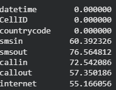
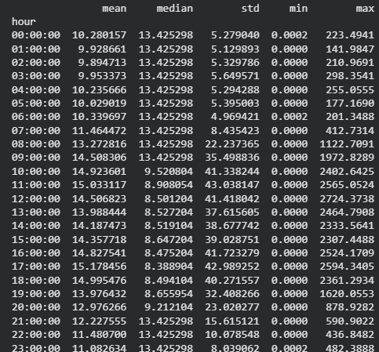
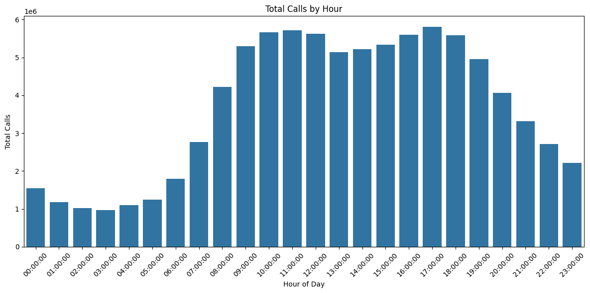
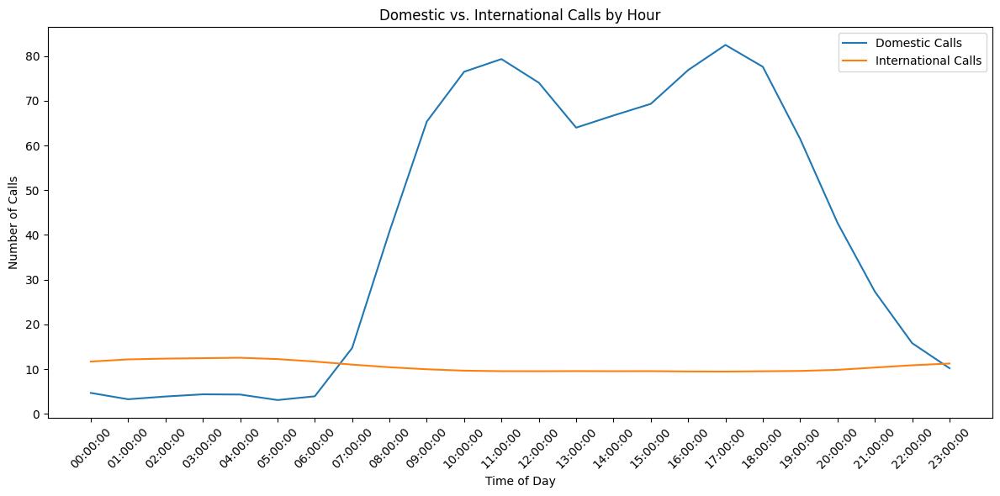
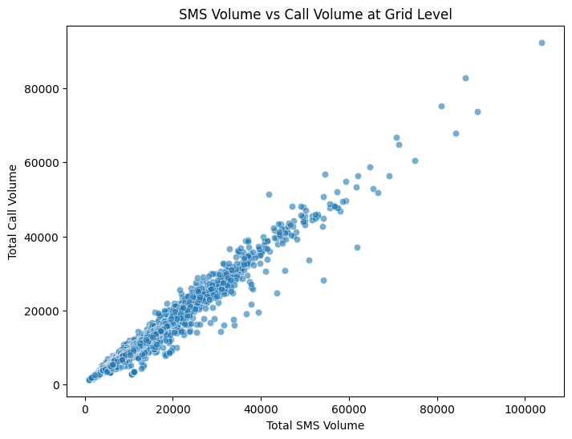

# Mobile Phone Data Analysis

# Introduction
This report presents an analysis on SMS, Calls and Internet recorded between `2013-11-02`,  `2013-11-04`, `2013-11-06` with the goal of identifying patterns in mobile phone usage for the different specified tasks above.

## Overview of Approach
To achieve this objective, the dataset was loaded from from Kaggle and processed using pandas libraries. Visulaizations were made using seaborn library. Through this, statistical questions on activity patters, correlation between different types of activities and comparison between domestic and international usage were identifed. 

## Approach 
 **Data Loading and Merging**

The Mobile phone activity in a city dataset was loaded and the three datafiles loaded for analysis. These datasets were
`sms-call-internet-mi-2013-11-02.csv, 
sms-call-internet-mi-2013-11-04.csv, 
sms-call-internet-mi-2013-11-06.csv`

The three datasets were cobined into one single dataframe for unified analysis where the combined data had `6564031` rows of data and 8 columns.

`Date` and `Hour` columns were added to enable a granular time based analysis. 

**Data Analysis and Feature Engineering**

Missing values were checked by computing the percentage of missingness in the different columns. This was done using the pandas function where `21137195` of missing values were identified from five attributes `SMSin`, `SMSout`, `Callin`, `Callout` and `Internet`. This were handled with mean imputation ensuring data completeness and skewnes removal.

Three features were engineered `total_sms`, `total_calls` and `total_internet` to summarize the different activity types. For total_sms and tota_calls, the incoming and outgoing sms and calls were summed up. 

The rows were filtered based on country code where country codes not equal to 39 were regarded as from international activity and the others as domestic activities. 

To be able to understand the distribution of calls over night and day times, two periods were filtered i.e., between 6AM-8PM was regarded as daytime and 8PM-6AM as nightime. This was done using pandas filter methods where the records withing the specified range were placed to the different categories.

## Key Finding

The three datasets contained `1847331`,`2299544`,`2417156` records and `8` attributes respectively and the merged a total of 6564031 records. 
From this we had a total of `21137195` missing values from five attributes where the percentage of the missigness is as shown below. 

From this data we had  `10,000` unique grid squares and `302` unique country codes. 

### Statistical Summary

The average total calls is highest during mid-afternoons hours with a peak average of 15.2 at 17:00 hours, and maximum number of calls of 2594.3 in total. Early morning have the lowest average at 2:00 with an average calls of 9.89 with a maximum calls at 211. 
At peak hour, the standard deviation is at 42.98 indicating significant differences in grid activity during peak hours. The average call activity remains high during the daytimes and lower during nighttimes.

### Peak Hours

From the plot we can see the peak hour day for the calls is `17:00` and the lowest hour day is `3:00`
This can be attributed to the fact that at 17:00 most people are active and also mostly from their work places thus high call rates but at 3:00 hours a few individuals would be active thus low call hours. 

This can also be seen in the daytime vs nightime analysis where `73.7%` of the total calls happen during the daytime with only `26.3%` happening at night times.

### Domestic VS International Patters
The hourly average of domestic vs international calls shows a clear call pattern whereby domestic calls peak during daytime and drop significantly during night hours while international calls are more evenly distributed across the different times with a relatively higher rates at night. 
This is a shown in the plot below

### Percentage of SMS and Calls
<table>
  <thead>
    <tr>
      <th>Metric</th>
      <th>Domestic</th>
      <th>International</th>
    </tr>
  </thead>
  <tbody>
    <tr>
      <td>Percentage of calls</td>
      <td>33.12%</td>
      <td>66.90%</td>
    </tr>
    <tr>
      <td>Percentage of SMS</td>
      <td>25%</td>
      <td>75%</td>
    </tr>
  </tbody>
</table>

### Ratio of incoming vs outgoing calls

The ratio of incoming to outgoing calls is for every `167` incoming calls there are `100` outgoing calls.

### Correlation between total calls and total sms

There is a strong positive correlation between total sms and total call volumes across the grids. As sms volumes increase, the total calls volume also increases. This is shown in the plot below.

